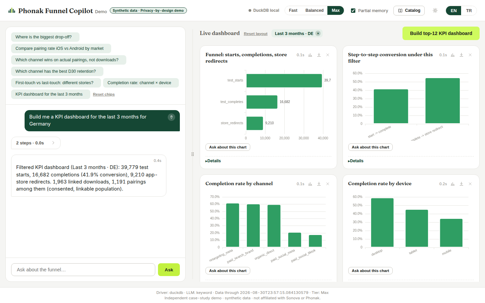

# Funnel Copilot

**Ask a question in plain language → an agent plans, writes governed SQL against a
medallion architecture, self-corrects, and answers with the right chart → or builds a
live, filtered KPI dashboard from one sentence.**

> *Independent portfolio demo · synthetic data · not affiliated with any hearing-care company.*



*"Build me a KPI dashboard for the last 3 months for Germany" — the agent extracts the
intent and the filters, slices the dimensional gold cubes, and assembles the board with
an explicit filter chip. Clearing the chip returns to the full-data view.*

---

## What this is

A conversational analytics agent for a hearing-aid acquisition funnel
(web hearing test → app download → device pairing → D30 retention), built end-to-end:
synthetic event generator → bronze/silver/gold medallion (DuckDB locally, Databricks in
the cloud — same SQL file builds both) → a hand-written tool-use agent loop → FastAPI +
a single-file frontend with live agent trace, streaming answers and a draggable
chat/dashboard layout.

Everything here was designed around three ideas:

1. **Governance lives in the schema, not in prompts.** The agent may only SELECT from a
   whitelisted medallion inventory (enforced twice: a sqlglot AST guardrail plus a legacy
   token check). Consent gating is a silver view, so a privacy rule is a join target —
   not a convention someone has to remember.
2. **Answers must be auditable.** Every answer streams its trace — plan, schema lookups,
   knowledge citations, each SQL attempt with per-step timings — and keeps it as a
   collapsible "n steps · Xs" record on the message. The SQL that produced a number is
   always one click away.
3. **The gold layer learns.** Frequently asked ad-hoc questions get promoted into gold
   marts; when users started asking *filtered* dashboard questions, two day-grain
   dimensional cubes were added so any date/market/channel/device slice is a cheap
   `WHERE`, not a raw-event scan. (Grain rule learned the hard way: *store the finest
   grain a user can ask about* — the cubes started weekly and "last 3 days" forced the
   redesign. The fix also added an honesty rule: the agent must state the exact applied
   filter and call out any deviation from what was asked.)

## Feature tour

| | |
|---|---|
| **Natural-language Q&A** | Plans against a documented schema, prefers thin SELECTs from gold, descends to silver/bronze and writes its own SQL for novel questions, self-corrects failed SQL (max 2 retries). |
| **One-sentence dashboards** | `build_dashboard` tool: relative date ranges anchored to the data's own horizon (never wall-clock), validated market/channel/device/platform filters, ~10 KPIs from the cubes, explicit filter label. |
| **Ideal chart selection** | A pure form heuristic picks the default per result (line for trends, sorted horizontal bars for long-labeled categories, grouped bars for cross-tabs, stat tile for single values); the manual per-card switcher always wins and persists. |
| **Live agent trace** | SSE stream with per-step second badges; collapses Claude-style to a summary row when the answer lands. |
| **RAG citations** | Four methodology notes (attribution, censoring, consent, metric definitions) retrieved via embeddings with a pure-Python BM25 fallback; answers cite their sources as chips. |
| **Partial conversation memory** | Structured summaries of the last turns, injected only when a deterministic gate says the question is referential — independent questions can never be contaminated. Toggleable in the UI. |
| **Model tiers** | fast / balanced / max, per-request, with per-tier agent caches. |
| **Sentinel** | A scheduled watchdog (script + Databricks Job notebook) that detects volume anomalies and schema drift statistically against a trailing 28-day band, with a human checkpoint before anything is acted on. |
| **UI** | Light/dark themes over one token contract, EN/TR throughout, connection indicator, animated sound-bars mark while the agent thinks, WCAG-minded palette validated for both surfaces and CVD. |

More screenshots live in [`reports/`](reports/) — every module shipped with Playwright
evidence and a test report.

## Architecture

```
   User ──► FastAPI (/api/ask/stream, SSE)
              │
              ▼
   Agent loop (hand-written; no frameworks — a deliberate choice, see below)
     tools: get_schema · search_knowledge · get_metric · run_sql · build_dashboard
              │                                   │
              ▼                                   ▼
   Guardrails (sqlglot AST + legacy)        Dashboard engine
     SELECT-only · table whitelist            {{where}} templates over day-grain cubes
     LIMIT enforcement                        validated filters, honest range labels
              │
              ▼
   Pluggable driver ──► DuckDB (local) │ Databricks SQL (cloud)
              │
              ▼
   Medallion (one SQL file builds both engines)
     bronze: web_events · app_events · id_bridge          (raw, commented)
     silver: user stages · consent-gate view · linked_journeys
     gold:   12 governed marts + 2 day-grain dimensional cubes
```

Full detail with a rendered diagram: [`docs/architecture.md`](docs/architecture.md).
API surface: [`docs/api_contract.md`](docs/api_contract.md).
Sentinel design: [`docs/sentinel_design.md`](docs/sentinel_design.md).

**Why no agent framework?** The loop is ~300 lines and every behavior in it is
load-bearing for this use case: guardrail placement, retry budgets, SSE event shapes,
the honesty rule. Owning it keeps the failure modes inspectable — the trade-offs against
LangChain/LlamaIndex-style stacks are documented in
[`docs/knowledge/methodology.md`](docs/knowledge/methodology.md).

## Quickstart

```bash
pip install -r requirements.txt

# 1. Generate the synthetic dataset (seed 42 — fully reproducible)
python src/generate_data.py

# 2. Run — works with NO API key (deterministic keyword planner):
uvicorn app.main:app --reload
# open http://127.0.0.1:8000

# 3. Real LLM (optional): put OPENAI_API_KEY=... in .env — the app auto-loads it.
#    Model tiers are configured in config/model_tiers.json.

# 4. Databricks (optional): add DATABRICKS_SERVER_HOSTNAME / HTTP_PATH / TOKEN to .env,
#    then load the medallion into your workspace and switch drivers:
python scripts/load_to_databricks.py
AGENT_DB=databricks uvicorn app.main:app
```

Turkish step-by-step deployment notes (Databricks Free Edition, the sentinel Job,
Docker + Cloudflare Tunnel, and the optional `DEMO_PASSPHRASE` demo gate
for a public deployment): [`docs/deploy_guide.md`](docs/deploy_guide.md).

## Repository layout

```
src/generate_data.py      synthetic event generator (calibrated funnel, planted patterns)
sql/medallion.sql         the whole medallion — single source for DuckDB AND Databricks
sql/sentinel/             watchdog control-band queries
src/agent/                agent loop, tools, guardrails, dashboard engine, memory, RAG,
                          sentinel core, pluggable drivers, LLM providers
app/main.py               FastAPI endpoints (REST + SSE)
app/static/index.html     the entire frontend (vendored libs, no build step)
config/                   KPI registries, model tiers, sentinel registry
docs/                     design contract, architecture, API contract, knowledge base
notebooks/                analysis walkthrough + the sentinel Databricks Job
tests/                    433 tests (hermetic — no network, no API keys needed)
reports/                  per-module test reports + Playwright screenshots
```

## Data

All data is **synthetic**, produced by `src/generate_data.py` with a fixed seed —
100,000 web users flowing to 7,461 retained app users, with realistic patterns planted
(channel quality gaps, device effects, multi-touch journeys, repeat test starts,
right-censoring). The parquet files are not committed; one command regenerates them
byte-for-byte. No real user data appears anywhere in this repository.

## Tests

```bash
python -m pytest -q          # 433 passed
```

The suite is hermetic: a deterministic keyword LLM is pinned in `tests/conftest.py`, so
no network or keys are required. Coverage includes guardrail injection attempts, cube ↔
legacy-mart parity (the funnel invariant is asserted, not assumed), filter composition
safety, relative-date anchoring, SSE event shapes, and end-to-end agent flows.

---

*Built as a job-application case study. The brand-inspired look is deliberately
**not** a clone — no logos or trade dress are used, fonts are substituted with open
alternatives, and every page carries the disclaimer above. Design rules live in
[`docs/DESIGN.md`](docs/DESIGN.md).*
