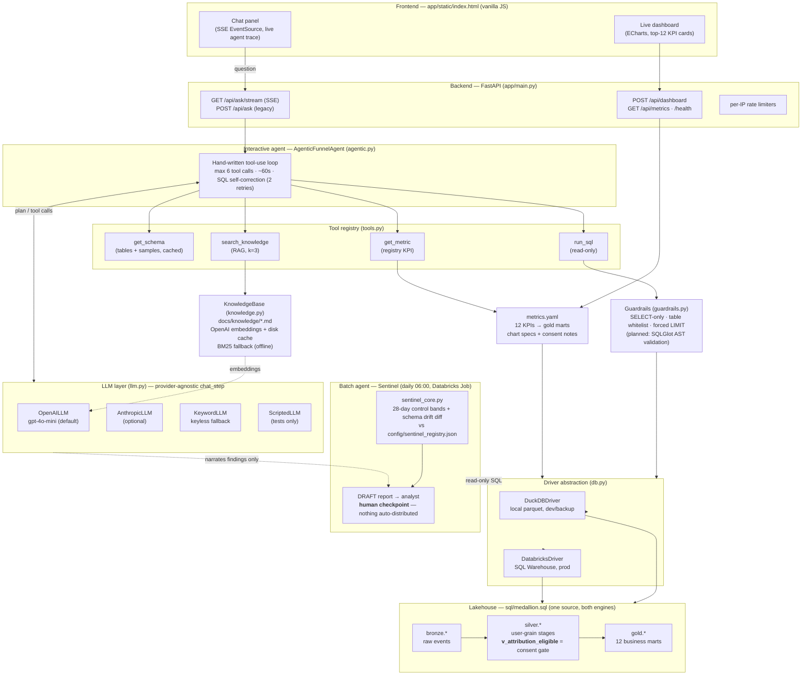

# System Architecture — Phonak Funnel Copilot

Two agents live in this system: an **interactive analytics agent** (answers
questions, live) and a **batch sentinel agent** (watches data health, daily).
They share the same warehouse, the same governance layer, and the same LLM
plumbing — but never call each other.

## The two agents

**1. Interactive agent** (`AgenticFunnelAgent`) — answers natural-language
questions. One hand-written loop: the LLM plans, calls tools, observes
results, fixes its own SQL on error (max 2 retries), then writes the answer.
Every step streams to the browser as an SSE event — the visible "agent trace".
It is *stateless per question* today: no conversation memory (a planned
upgrade adds a rolling window of recent turns).

**2. Sentinel agent** (`sentinel_core` + Job) — runs on a schedule, not on
request. Pure statistics detect anomalies and schema drift; the LLM is only
allowed to *narrate* confirmed findings, never to detect or invent them. Its
output is a DRAFT report behind a human checkpoint. The two agents never
invoke each other; they share the driver, the lakehouse, and the LLM layer.

## Tools (interactive agent)

| Tool | What it does | Safety property |
|---|---|---|
| `get_schema` | Table/column/type inventory + 3 sample rows | read-only, cached |
| `run_sql` | Executes LLM-written SQL | guardrails first: SELECT-only, whitelist, forced LIMIT |
| `search_knowledge` | Retrieves methodology/privacy/insight chunks | citations surfaced to the user |
| `get_metric` | Runs a registry KPI from a gold mart | curated SQL, never LLM-written |

## Models

| Purpose | Model | Where |
|---|---|---|
| Planning, tool calls, answers, TR translation | `gpt-4o-mini` (env-overridable via `AGENT_MODEL`) | OpenAILLM |
| RAG embeddings | `text-embedding-3-small` (disk-cached) | KnowledgeBase |
| Optional alternative provider | Claude (any) | AnthropicLLM |
| Keyless demo / CI | none — deterministic keyword matching | KeywordLLM |

## Memory

- **Static memory (RAG):** `docs/knowledge/*.md` — methodology, privacy rules,
  analytical insights, attribution doctrine. Retrieval-augmented, cited.
- **Schema memory:** `get_schema` cache + `config/sentinel_registry.json`
  (the sentinel's "what normal looks like").
- **Conversation memory:** none yet — each question is independent.
  Planned (quality round): a rolling window of the last N turns so follow-ups
  like "now split that by market" work.
- **No user data is memorised:** the agent stores nothing about viewers;
  the only persisted artefacts are reports it writes.

## Governance spine (what makes this defensible)

One line: **row-level cross-device joins exist only through
`silver.v_attribution_eligible`** — consent gating lives in the schema, the
guardrail whitelist, and the system prompt, not in analyst discipline.
