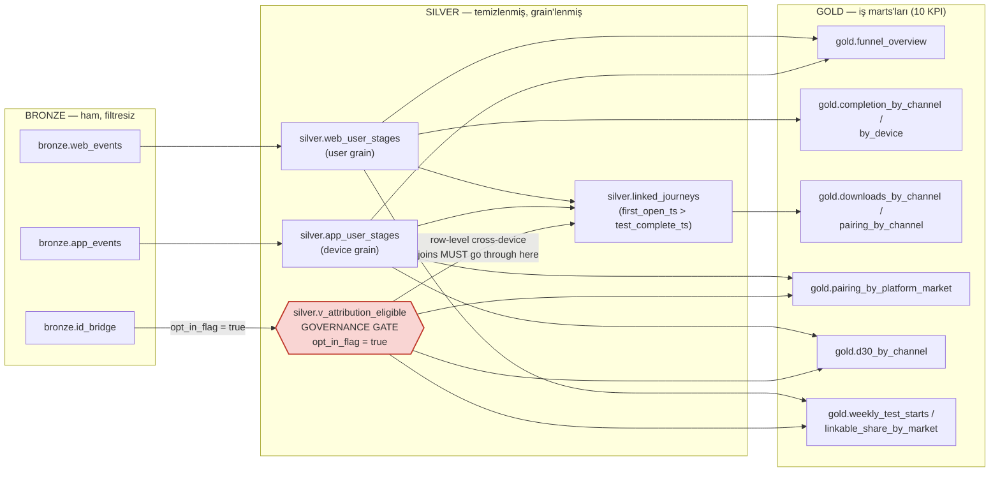

# M2 Dağıtım Rehberi (Türkçe)

Bu rehber, Phonak Funnel Copilot web uygulamasını (M2) sıfırdan ayağa
kaldırmak için adım adım, kopyala-yapıştır çalıştırılabilir talimatlar
içerir. Sırasıyla: lokal çalıştırma, Docker ile çalıştırma, Cloudflare
Tunnel ile `phonak.vmgorken.com` adresine bağlama, `ANTHROPIC_API_KEY`
verme ve Databricks'e geçiş.

Tüm komutlar repo kök dizininden (`sonova_case/`) çalıştırılmalıdır.

> **M18 notu:** Gerçek VPS prodüksiyon dağıtımı (kullanıcının kendi
> makinesinden `ssh vps` ile uyguladığı, Cloudflare Tunnel ile
> `phonak.vmgorken.com`'a bağlanan güncel akış) için
> **[docs/deploy_runbook_vps.md](deploy_runbook_vps.md)** dosyasına
> bakın — `env_file: .env`, salt-loopback port bağlama (`127.0.0.1:8000`)
> ve `datagen` profiliyle güncellenmiş `Dockerfile`/`docker-compose.yml`'i
> esas alır. Bu sayfadaki Bölüm 2'nin Docker komutları (M2'den kalma) hâlâ
> kavramsal olarak doğrudur ama port/ortam-değişkeni detaylarında runbook
> güncel olanı yansıtır.

---

## 1. Lokalde çalıştırma (uvicorn)

Gereksinim: Python 3.11+.

```bash
# 1. Bağımlılıkları kur
pip install -r requirements.txt

# 2. (opsiyonel) veri dizinini özelleştir — varsayılan zaten <repo>/data
export AGENT_DATA_DIR="$(pwd)/data"

# 3. Sunucuyu başlat
uvicorn app.main:app --host 0.0.0.0 --port 8000 --reload
```

Tarayıcıda aç: `http://localhost:8000`

Hızlı doğrulama:

```bash
curl -s http://localhost:8000/health | python3 -m json.tool

curl -s -X POST http://localhost:8000/api/ask \
  -H "Content-Type: application/json" \
  -d '{"question": "Weekly trend of test starts", "lang": "en"}' | python3 -m json.tool
```

Not: `ANTHROPIC_API_KEY` tanımlı değilse uygulama otomatik olarak
deterministik `KeywordLLM` planlayıcısına düşer — demo tamamen
çalışır durumda kalır, sadece serbest metin SQL modu devre dışıdır ve
TR anlatı çevirisi (bkz. Bölüm 4) uygulanmaz.

---

## 2. Docker ile build/run

### 2.1 Sadece Docker (compose'suz)

```bash
docker build -t phonak-funnel-copilot:latest .

docker run --rm -p 8000:8000 \
  -v "$(pwd)/data:/app/data:ro" \
  -e ANTHROPIC_API_KEY="${ANTHROPIC_API_KEY:-}" \
  phonak-funnel-copilot:latest
```

### 2.2 docker compose (önerilen)

```bash
# ANTHROPIC_API_KEY olmadan (KeywordLLM ile):
docker compose up --build

# ANTHROPIC_API_KEY ile:
ANTHROPIC_API_KEY=sk-ant-xxxxxxxx docker compose up --build

# arka planda çalıştırmak için:
ANTHROPIC_API_KEY=sk-ant-xxxxxxxx docker compose up --build -d

# durdurmak için:
docker compose down
```

`docker-compose.yml`, `./data` klasörünü konteynerin `/app/data`
yoluna salt-okunur (`:ro`) olarak bağlar — `data/` ve
`generate_data.py` hiçbir şekilde imaja gömülmez veya değiştirilmez.

Doğrulama aynı `curl` komutlarıyla yapılabilir (Bölüm 1).

---

## 3. Cloudflare Tunnel ile `phonak.vmgorken.com` rotası ekleme

Bu bölüm genel bir talimattır; DNS ve Cloudflare hesabı erişiminin
zaten mevcut olduğu varsayılır.

### 3.1 `cloudflared` kurulumu

```bash
# Debian/Ubuntu
curl -L --output cloudflared.deb \
  https://github.com/cloudflare/cloudflared/releases/latest/download/cloudflared-linux-amd64.deb
sudo dpkg -i cloudflared.deb

# macOS
brew install cloudflare/cloudflare/cloudflared
```

### 3.2 Cloudflare hesabına giriş ve tünel oluşturma

```bash
cloudflared tunnel login
cloudflared tunnel create phonak-funnel-copilot
```

Bu komut `~/.cloudflared/<TUNNEL_ID>.json` kimlik dosyasını üretir ve
`<TUNNEL_ID>` değerini ekrana yazar.

### 3.3 `config.yml` örneği

`~/.cloudflared/config.yml` dosyasını oluşturun:

```yaml
tunnel: <TUNNEL_ID>
credentials-file: /home/<kullanici>/.cloudflared/<TUNNEL_ID>.json

ingress:
  - hostname: phonak.vmgorken.com
    service: http://localhost:8000
  - service: http_status:404
```

Not: Uygulama Docker içinde çalışıyorsa ve `cloudflared` host
makinede çalışıyorsa `http://localhost:8000` doğru hedeftir (port
`docker-compose.yml`'de `8000:8000` olarak dışa açıldığı için).
`cloudflared`'ı aynı Docker ağında konteyner olarak çalıştırırsanız
`service: http://funnel-copilot:8000` (compose servis adı) kullanın.

### 3.4 DNS rotasını bağlama ve tüneli başlatma

```bash
cloudflared tunnel route dns phonak-funnel-copilot phonak.vmgorken.com

# ön planda test için:
cloudflared tunnel run phonak-funnel-copilot

# kalıcı servis olarak (systemd) kurmak için:
sudo cloudflared service install
sudo systemctl enable --now cloudflared
```

Doğrulama:

```bash
curl -s https://phonak.vmgorken.com/health | python3 -m json.tool
```

`app/main.py` içindeki CORS ayarları zaten `https://phonak.vmgorken.com`,
`https://vmgorken.com`, `https://www.vmgorken.com` ve
`http://localhost:*` origin'lerine izin verir; ek bir yapılandırma
gerekmez.

---

## 4. `ANTHROPIC_API_KEY`'i env ile verme

Anahtarı asla koda veya git deposuna yazmayın. Üç yöntem:

**a) Kabuk ortam değişkeni (geçici, tek komut için):**

```bash
ANTHROPIC_API_KEY=sk-ant-xxxxxxxx uvicorn app.main:app --host 0.0.0.0 --port 8000
```

**b) `.env` dosyası (docker compose otomatik okur, git'e eklemeyin):**

```bash
cat > .env << 'EOF'
ANTHROPIC_API_KEY=sk-ant-xxxxxxxx
AGENT_MODEL=claude-sonnet-4-5
EOF

echo ".env" >> .gitignore
docker compose up --build
```

**c) Sistem servisi (systemd) için `EnvironmentFile`:**

```ini
# /etc/phonak-funnel-copilot.env (izinleri 600 yapın)
ANTHROPIC_API_KEY=sk-ant-xxxxxxxx
```

```ini
# systemd unit dosyasında:
EnvironmentFile=/etc/phonak-funnel-copilot.env
```

`ANTHROPIC_API_KEY` tanımlandığında `/health` uç noktası `"llm": "anthropic"`
döner; tanımlı değilse `"llm": "keyword"` döner — dağıtımdan sonra bunu
kontrol ederek hangi modda çalıştığınızı doğrulayabilirsiniz.

---

## 5. Databricks'e geçiş (M3b, Free Edition)

Bu bölüm, lokal DuckDB yerine ücretsiz bir Databricks Free Edition
çalışma alanını (workspace) veri katmanı olarak kullanmak için baştan
sona izlenecek adımları içerir. Databricks tarafında hesap/warehouse
kurulumu bir kereye mahsustur; `scripts/load_to_databricks.py` verinin
yüklenmesini tek komutla yapar ve tekrar çalıştırmak güvenlidir
(idempotent).

> Not: Bu adımların tamamı **sizin kendi makinenizde**, Databricks'e
> gerçek ağ erişimi olan bir ortamda çalıştırılmalıdır — bu depoyu
> hazırlayan ajan ortamının Databricks'e ağ erişimi yoktur ve bu
> bölümdeki komutları çalıştırmamıştır.

### 5.1 Databricks Free Edition hesabı açma

1. `https://www.databricks.com/learn/free-edition` adresine gidin.
2. "Sign up" ile ücretsiz hesabınızı oluşturun (e-posta doğrulaması
   gerekir). Kurumsal SSO gerekmez, kişisel e-posta ile de açılabilir.
3. Kayıt sonrası otomatik olarak bir workspace'e yönlendirilirsiniz
   (ör. `https://<workspace-adı>.cloud.databricks.com`).

### 5.2 SQL Warehouse bağlantı bilgilerini bulma

Free Edition workspace'inde varsayılan olarak küçük bir "Starter
Warehouse" hazır gelir; ek bir warehouse oluşturmanıza gerek yoktur.

1. Sol menüden **SQL Warehouses**'a tıklayın.
2. Listede **Starter Warehouse**'a tıklayın (yoksa "Create SQL
   Warehouse" ile küçük boyutlu bir tane oluşturun).
3. Açılan sayfada **Connection details** sekmesine geçin. Burada iki
   değeri kopyalayın:
   - **Server hostname** → `.env`'de `DATABRICKS_SERVER_HOSTNAME`
     olacak (örn. `dbc-a1b2c3d4-e5f6.cloud.databricks.com`).
   - **HTTP path** → `.env`'de `DATABRICKS_HTTP_PATH` olacak (örn.
     `/sql/1.0/warehouses/a1b2c3d4e5f6g7h8`).

### 5.3 Personal Access Token (PAT) oluşturma

1. Sağ üstteki kullanıcı menüsünden **Settings** → **Developer**'a
   gidin.
2. **Access tokens** bölümünde **Manage** → **Generate new token**'a
   tıklayın.
3. Bir açıklama girin (ör. `sonova-funnel-copilot`) ve isteğe bağlı bir
   son kullanma tarihi seçin, **Generate**'e basın.
4. Gösterilen token'ı (`dapi...` ile başlar) hemen kopyalayın — bu
   ekran kapandıktan sonra bir daha görüntülenemez. Bu token `.env`'de
   `DATABRICKS_TOKEN` olacak.

Token'ı asla koda veya git deposuna yazmayın; sadece `.env` dosyasına
ekleyin (`.gitignore` içinde zaten `.env` var).

### 5.4 `.env` dosyasına bağlantı satırlarını ekleme

Repo kökünde `.env` dosyanız yoksa oluşturun, varsa aşağıdaki dört
zorunlu satırı (ve isteğe bağlı katalog/şema satırlarını) ekleyin:

```bash
cat >> .env << 'EOF'
DATABRICKS_SERVER_HOSTNAME=dbc-a1b2c3d4-e5f6.cloud.databricks.com
DATABRICKS_HTTP_PATH=/sql/1.0/warehouses/a1b2c3d4e5f6g7h8
DATABRICKS_TOKEN=dapixxxxxxxxxxxxxxxxxxxxxxxxxxxxxxxx
DATABRICKS_CATALOG=workspace
DATABRICKS_SCHEMA=sonova
EOF
```

`DATABRICKS_CATALOG` ve `DATABRICKS_SCHEMA` opsiyoneldir — atlarsanız
sırasıyla `workspace` ve `sonova` varsayılanları kullanılır. Free
Edition workspace'lerinde varsayılan katalog adı genelde `workspace`
olduğundan çoğu kurulumda bu iki satırı hiç eklemenize gerek yoktur.

`AGENT_DB=databricks` satırını **henüz eklemeyin** — önce veriyi
yükleyip doğrulayacağız (Bölüm 5.6), uygulama o ana kadar lokal
DuckDB ile çalışmaya devam etsin.

### 5.5 Bağımlılığı kurma ve veriyi yükleme

```bash
pip install -r requirements.txt   # databricks-sql-connector artık gerçek bir bağımlılık

python scripts/load_to_databricks.py
```

Bu komut sırasıyla:

1. `<catalog>.<schema>` şemasını oluşturur (yoksa),
2. `<catalog>.<schema>.raw` adında bir Unity Catalog volume'u oluşturur
   (yoksa),
3. `data/` altındaki `web_events.parquet`, `app_events.parquet`,
   `id_bridge.parquet` dosyalarını (generator'ın `_ground_truth.parquet`
   dosyası **hariç**) bu volume'e `PUT ... OVERWRITE` ile yükler,
4. her biri için `CREATE OR REPLACE TABLE ... AS SELECT * FROM
   parquet.\`...\`` ile tabloyu materialize eder,
5. her tablo için `SELECT COUNT(*)` çalıştırıp yerel (pyarrow ile
   okunan) satır sayısıyla karşılaştırarak bir doğrulama özeti basar.

Beklenen çıktının sonu şuna benzer (M3c'den itibaren, ham tablo
doğrulamasından sonra script otomatik olarak bronze/silver/gold
katmanlarını da kurar — bkz. Bölüm 6):

```
Raw layer verification:
  web_events: local=307529 databricks=307529 [OK]
  app_events: local=80156 databricks=80156 [OK]
  id_bridge: local=6863 databricks=6863 [OK]
-> Applying medallion layers (bronze/silver/gold) from sql/medallion.sql ...
-> Verifying gold layer row counts...

Gold layer verification:
  gold.funnel_overview: 5 row(s)
  gold.step_conversion: 5 row(s)
  gold.completion_by_channel: 5 row(s)
  gold.completion_by_device: 3 row(s)
  gold.downloads_by_channel: 5 row(s)
  gold.pairing_by_channel: 5 row(s)
  gold.pairing_by_platform_market: 6 row(s)
  gold.d30_by_channel: 5 row(s)
  gold.weekly_test_starts: 13 row(s)
  gold.linkable_share_by_market: 3 row(s)

Done: raw tables loaded and verified, and the bronze/silver/gold medallion
layer was built successfully.
```

Script idempotenttir — tekrar çalıştırmak güvenlidir (mevcut şema/
volume atlanır, dosyalar `OVERWRITE` ile yeniden yüklenir, tablolar
`CREATE OR REPLACE` ile yeniden oluşturulur — bronze/silver/gold
katmanları dahil).

> **M11 sonrası:** repoyu M11 ile güncelledikten sonra (doğal dilde
> "KPI dashboard'u kur" komutunun dayandığı iki yeni dimensional gold
> tablosu — `gold.web_funnel_daily_cube`, `gold.journey_daily_cube` —
> `sql/medallion.sql`'e eklendi) Databricks'i güncel tutmak için
> `python scripts/load_to_databricks.py` yeniden çalıştırılmalı; script
> aynı dosyayı (`sql/medallion.sql`) uyguladığı için tek komut yeterli,
> ayrı bir migration adımı yok.
>
> **M11-fix sonrası (grain değişikliği):** bu iki cube başlangıçta
> `week_start` grain'liydi; gerçek bir kullanımda "son 3 gün, Almanya"
> isteği sessizce "son 6 hafta" kokpitine dönüştü, çünkü haftalık grain
> gün seviyesinde bir filtreyi yapısal olarak cevaplayamıyordu. Cube'lar
> `day_date` (günlük) grain'e yeniden kesildi — tekrar
> `python scripts/load_to_databricks.py` çalıştırmak, tabloları
> `CREATE OR REPLACE` ile yeni şemayla (week_start yerine day_date
> kolonu) günceller; ayrı bir migration/DROP adımı gerekmez, script zaten
> idempotent.

**Sık karşılaşılan hatalar** (script bunları otomatik olarak Türkçe
bir ipucuyla birlikte basar):

| Hata belirtisi                         | Muhtemel sebep                                   |
|-----------------------------------------|---------------------------------------------------|
| `403` / `PERMISSION_DENIED` / kimlik doğrulama hatası | `DATABRICKS_TOKEN` yanlış veya süresi dolmuş     |
| `404` / "warehouse bulunamadı"          | `DATABRICKS_HTTP_PATH` yanlış                     |
| İsim çözümlenemedi (`getaddrinfo`)      | `DATABRICKS_SERVER_HOSTNAME` yanlış               |
| Zaman aşımı                             | Warehouse uykuda / ağ-VPN sorunu                  |

### 5.6 Uygulamayı Databricks'e yönlendirme

Yükleme başarıyla tamamlandıktan sonra `.env` dosyanıza şu satırı
ekleyin:

```bash
echo "AGENT_DB=databricks" >> .env
```

Uygulamayı yeniden başlatın:

```bash
# lokal uvicorn:
uvicorn app.main:app --host 0.0.0.0 --port 8000

# ya da docker compose:
docker compose up --build
```

`docker-compose.yml` içindeki `environment:` bloğu `AGENT_DB` ve
`DATABRICKS_*` değişkenlerini zaten `.env`'den okuyacak şekilde
tanımlıdır — ek bir değişiklik gerekmez.

Doğrulama:

```bash
curl -s http://localhost:8000/health | python3 -m json.tool
# beklenen: {"driver": "databricks", ...}
```

`agent.db.DatabricksDriver`, bağlantıyı `DATABRICKS_CATALOG`/
`DATABRICKS_SCHEMA` ile açar (varsayılan `workspace`/`sonova`), böylece
agent'ın kullandığı `web_events`, `app_events`, `id_bridge` gibi
niteliksiz (şemasız) tablo adları ve M3c'nin `bronze.*`/`silver.*`/
`gold.*` nesneleri aynı bağlantının varsayılan katalog'u altında
doğrudan çözülür — `metrics.yaml` içindeki SQL sorgularında hiçbir
değişiklik gerekmez (ANSI SQL, DuckDB/Databricks uyumlu yazılmıştır;
bkz. Bölüm 6).

### 5.7 Geri alma (rollback)

Databricks tarafında bir sorun çıkarsa, tek satırla lokal DuckDB'ye geri
dönebilirsiniz — veri kaybı olmaz, `data/` klasörü hep yerinde durur:

```bash
# .env içinde:
AGENT_DB=duckdb
```

Değişikliği kaydedip uygulamayı yeniden başlatın; `/health` tekrar
`{"driver": "duckdb", ...}` döner.

---

## 6. Medallion mimarisi (bronze/silver/gold, M3c)

M3c ile birlikte agent artık ham event tablolarını değil, **tek bir
versiyonlanmış SQL dosyasından** (`sql/medallion.sql`) inşa edilen
bronze/silver/gold katmanlarını okuyor. Bu dosya DuckDB'de ve
Databricks'te **birebir aynı** çalışır — tek fark `{{raw}}` şablon
değişkeninin neye eşitlendiği (DuckDB'de `"main"`, Databricks'te
`load_to_databricks.py`'nin verdiği şema, ör. `sonova`).

### 6.1 Katmanlar ne tutuyor

| Katman | İçerik | Grain | Örnek nesneler |
|--------|--------|-------|-----------------|
| **bronze** | Ham event'lerin filtresiz kopyası (`{{raw}}.*`'dan `CREATE OR REPLACE TABLE ... AS SELECT *`) | event | `bronze.web_events`, `bronze.app_events`, `bronze.id_bridge` |
| **silver** | Kullanıcı/cihaz grain'inde temizlenmiş tablolar + **tek** cross-device join kapısı | kullanıcı / cihaz / linked journey | `silver.web_user_stages`, `silver.app_user_stages`, `silver.v_attribution_eligible` (governance gate — `opt_in_flag = true`), `silver.linked_journeys` |
| **gold** | 10 KPI'nin okuduğu iş marts'ları — hepsi silver'dan türetilir | KPI'ye özel | `gold.funnel_overview`, `gold.completion_by_channel`, `gold.pairing_by_platform_market`, `gold.d30_by_channel`, ... (tam liste: `sql/medallion.sql`) |

`metrics.yaml`'daki 10 KPI artık kendi gold mart'ından ince (thin) bir
`SELECT` — ağır funnel/attribution/D30 SQL'i tek yerde,
`sql/medallion.sql` içinde yaşıyor.

### 6.2 Akış diyagramı (consent kapısı dahil)



**Consent kapısı:** `silver.v_attribution_eligible`, `bronze.id_bridge`'i
`opt_in_flag = true` ile filtreleyen bir view'dır (bu veri setinde her
satır zaten opt-in, ama kural budur: satır bazlı cross-device join'ler
**yalnızca** bu view üzerinden yapılır — asla doğrudan `bronze.id_bridge`
veya ham `web_events`/`app_events` join'i ile değil).
`silver.linked_journeys` ayrıca **zamansal sıra kuralını**
(`first_open_ts > test_complete_ts`) uygular, böylece bir app kurulumu
yalnızca ilgili hearing-test tamamlandıktan SONRA olduysa funnel'a
atfedilir.

### 6.3 Uygulanış: `agent.medallion.apply_medallion`

- **DuckDB** (`agent.db.DuckDBDriver`): sürücü kurulurken, parquet view'lar
  kaydedildikten hemen sonra `apply_medallion(con.execute, raw_schema="main")`
  çağrılır — tamamen in-memory, ~1 saniyeden kısa sürer.
- **Databricks** (`scripts/load_to_databricks.py`): ham tablolar yüklenip
  satır sayısı doğrulandıktan SONRA `apply_medallion(cursor.execute,
  raw_schema=settings.schema)` çağrılır — aynı katalogda `bronze`/
  `silver`/`gold` şemaları oluşturulur (bkz. Bölüm 5.5'teki örnek çıktı).
- Her iki motor da **aynı** `sql/medallion.sql` dosyasını, aynı sırada
  çalıştırır; tek şablon değişkeni `{{raw}}`'dır. `COMMENT ON` ifadeleri
  motor/versiyon reddederse loglanıp atlanır (non-fatal); başka her ifade
  hata verirse build durur (fatal).

### 6.4 Notebook

`notebooks/funnel_analysis.ipynb` — Databricks'e import edilebilir, gold
katmanını `%sql` hücreleriyle okuyan, İngilizce markdown anlatımlı bir
analiz defteri (funnel, en büyük drop-off, kanal hacim-vs-kalite,
platform×market pairing, D30, consent/censoring uyarıları). Bu ortamda
çalıştırılamaz — sözdizimi kasıtlı olarak sade tutuldu, serverless SQL
warehouse'da doğrudan çalışsın diye.

---

## 7. Nöbetçi ajanı (sentinel) için Databricks Job kurulumu (M5)

Bu bölüm, anomali/schema-drift nöbetçisini (`notebooks/sentinel_job.ipynb`)
günlük olarak çalıştıran bir Databricks Workflows Job'ı kurmayı anlatır.
Nöbetçi salt-okunurdur (bronze/silver/gold'a hiçbir şey yazmaz) ve
ürettiği rapor her zaman "DRAFT — pending analyst approval" başlığı
taşır — Job kendi başına kimseye bildirim göndermez, bkz.
`docs/sentinel_design.md`'deki "Human checkpoint" bölümü.

### 7.1 Ön koşul: repo'nun bir Databricks Repo olarak bağlı olması

`notebooks/sentinel_job.ipynb`, `src/agent/sentinel_core.py`'yi ve
`sql/sentinel/*.sql` dosyalarını **workspace üzerinden okur** — yani bu
repository'nin bir **Databricks Repo** olarak workspace'e klonlanmış
olması gerekir (Bölüm 5'teki `scripts/load_to_databricks.py` adımlarından
bağımsız, ayrı bir kurulum adımı):

1. Sol menüden **Repos** → **Add Repo**.
2. Bu repository'nin Git URL'ini girin (veya "existing repository" olarak
   zaten klonlanmışsa o yolu kullanın).
3. Klonlanan yolu not edin — genelde
   `/Workspace/Repos/<kullanıcı-e-postası>/sonova_case` biçimindedir.
   Notebook'un `repo_root` widget'ı bu yolu bekler (varsayılanı
   `/Workspace/Repos/sonova_case` — kendi klon yolunuz farklıysa Job
   parametresi olarak değiştirin, bkz. 7.3).

Not: repo bir Databricks Repo olarak bağlı değilse notebook otomatik
olarak devreye giren, `src/agent/sentinel_core.py`'nin bir alt kümesini
birebir yansıtan (ve öyle işaretlenmiş) bir yedek tanım hücresine düşer —
tespit mantığı yine çalışır, sadece gerçek import'un sağladığı "tek
kaynak" garantisi o çalıştırmada geçerli olmaz.

### 7.2 `config/sentinel_registry.json`'ın workspace'te olduğunu doğrulama

Registry dosyası da repo ile birlikte gelir (`config/sentinel_registry.json`)
— ayrı bir yükleme adımı gerekmez, notebook onu `repo_root/config/...`
yolundan okur. Databricks'teki ham tabloların `TIMESTAMP` kolon tipi
DuckDB'nin `TIMESTAMP_NS` etiketinden farklı raporlanır; ilk Databricks
çalıştırmasında `event_timestamp`/`linked_at` için bir "type changed"
**warning** görmeniz beklenir ve zararsızdır (bkz.
`docs/sentinel_design.md`'nin son bölümü) — registry'yi Databricks
bağlantısından yeniden üretmek isterseniz:

```python
# Bir Databricks notebook hücresinde:
from agent import sentinel_core as sc
from agent.db import get_driver

driver = get_driver("databricks")
registry = sc.build_registry(driver)
# registry'yi config/sentinel_registry.json'a elle kaydedip commit'leyin.
```

### 7.3 Job oluşturma: Workflows → Create Job → notebook task → schedule

1. Sol menüden **Workflows** → **Jobs** → **Create Job**.
2. **Task name**: `sentinel-daily` (veya benzeri).
3. **Type**: `Notebook`.
4. **Source**: `Workspace` (Repo'dan) — **Path**: repo içindeki
   `notebooks/sentinel_job.ipynb` dosyasını seçin.
5. **Cluster**: Free Edition'da mevcut **Starter Warehouse**'u SQL
   warehouse olarak değil, bir **serverless compute** (Serverless) ya da
   küçük bir all-purpose/job cluster olarak seçin — notebook `spark.sql`
   çağırdığı için bir Spark cluster'a ihtiyaç duyar (SQL Warehouse'un
   kendisi değil).
6. **Parameters** (widget değerleri, hepsi opsiyonel — boş bırakılırsa
   notebook içindeki varsayılanlar geçerli olur):
   - `catalog` → `workspace` (veya `DATABRICKS_CATALOG` neyse)
   - `schema` → `sonova` (veya `DATABRICKS_SCHEMA` neyse)
   - `as_of` → boş bırakın (otomatik: olgun maksimum tarih, bkz.
     `docs/sentinel_design.md`'deki "maturity buffer" açıklaması)
   - `repo_root` → repo'nun gerçek Databricks Repo yolu (Bölüm 7.1)
7. **Schedule**: **Add trigger** → **Scheduled** → günlük, saat **06:00**
   (ETL/medallion Job'ının tamamlanmasından sonraki ilk uygun saat —
   kendi ETL Job'ınızın bitiş saatine göre ayarlayın).
8. **Create**.

### 7.4 Env / izin notları

- Notebook, `spark.sql(...)` ile doğrudan Unity Catalog üzerinden
  okuduğu için `agent.db.DatabricksDriver`'ın kullandığı
  `DATABRICKS_TOKEN`/`DATABRICKS_HTTP_PATH` gibi ortam değişkenlerine
  **ihtiyaç duymaz** — Job'ı çalıştıran kullanıcı/service principal'ın
  kendi Databricks kimlik doğrulaması geçerlidir.
- Job'ı çalıştıran identity'nin şu izinlere sahip olması gerekir:
  - `<catalog>.<schema>` şemasındaki `web_events`, `app_events`,
    `id_bridge` tablolarında **SELECT** (nöbetçi bunların ötesine hiç
    yazmaz — bronze/silver/gold dahil hiçbir şeye yazma izni gerekmez).
  - `<catalog>.<schema>.raw` volume'unda (Bölüm 5.5'te oluşturulan)
    **WRITE** — rapor `/Volumes/<catalog>/<schema>/raw/sentinel/` altına
    yazılır; bu alt klasör yoksa notebook `dbutils.fs.mkdirs` ile
    oluşturur.
  - Repo'ya (Bölüm 7.1) **READ** — notebook'u ve `sql/sentinel/*.sql`/
    `src/agent/sentinel_core.py` dosyalarını okuyabilmek için.
- **LLM anlatımı opsiyoneldir**: notebook `agent.llm.get_llm()`'i
  dener; `ANTHROPIC_API_KEY`/`OPENAI_API_KEY` Job cluster'ında env
  olarak tanımlı değilse (genelde tanımlı DEĞİLDİR — Databricks
  cluster'larına bu anahtarları koymak ayrı bir güvenlik kararı
  gerektirir) otomatik olarak deterministik şablon özete düşer; bulgular
  (findings) hiçbir şekilde etkilenmez, sadece anlatım cümlesi
  değişir.
- Job başarıyla kurulduktan sonra ilk çalıştırmayı **Run now** ile elle
  tetikleyip `reports/sentinel/` (yerel) ile
  `/Volumes/<catalog>/<schema>/raw/sentinel/` (Databricks) çıktısını
  karşılaştırarak doğrulamanız önerilir — bu adım bu ortamda (Databricks
  ağ erişimi olmayan ajan sandbox'ı) çalıştırılamadı, sizin ortamınızda
  yapılacak tek Databricks-özel doğrulama budur.

---

## 8. Model tier'ları (M7a) — `"max"` tier'ını kendi hesabınıza göre ayarlayın

M7a ile birlikte `/api/ask` ve `/api/ask/stream` artık isteğe bağlı bir
`tier` parametresi kabul ediyor: `"fast"`, `"balanced"` veya `"max"`
(varsayılan `"max"` — bu bir kullanıcı kararı: maliyetten çok kalite).
Hangi tier'ın hangi modele karşılık geldiği `config/model_tiers.json`
dosyasında tanımlı ve şu şekilde gelir:

```json
{"fast": "gpt-4o-mini", "balanced": "gpt-4o", "max": "gpt-4o"}
```

**Önemli:** `"max"` için gelen `gpt-4o` değeri güvenli, yaygın erişimli
bir varsayılandır — sizin OpenAI hesabınızda erişebildiğiniz **en
güçlü** model bu olmayabilir. Gerçek bir dağıtımdan önce
`config/model_tiers.json` dosyasındaki `"max"` satırını, hesabınızın
gerçekten erişebildiği en güçlü modelle (ör. `gpt-4.1`, `o1`, veya
hesabınıza yeni eklenmiş başka bir model) değiştirmenizi öneririz:

```bash
# config/model_tiers.json içinde "max" değerini elle düzenleyin, ya da
# dosyaya hiç dokunmadan ortam değişkeniyle override edin:
export AGENT_MODEL_MAX="gpt-4.1"   # hesabınızda gerçekten mevcut olan model
```

`AGENT_MODEL_FAST` / `AGENT_MODEL_BALANCED` / `AGENT_MODEL_MAX` ortam
değişkenleri, dosyayı hiç değiştirmeden her tier'ı ayrı ayrı override
eder. Eski `AGENT_MODEL` değişkeni tanımlıysa (bkz. Bölüm 4), o her
zaman kazanır — üç tier de aynı sabitlenmiş modele döner; bu, M7a
öncesi tek-model kurulumların hiçbir değişiklik yapmadan çalışmaya devam
etmesini sağlar. `GET /health`'in `tiers` alanı, her tier'ın o an hangi
modele çözüldüğünü gösterir — dağıtımdan sonra bunu kontrol ederek
doğrulayabilirsiniz. Bu tier seçimi yalnızca `OpenAILLM` içindir;
`ANTHROPIC_API_KEY` ile çalışan dağıtımlarda (bkz. Bölüm 4) `tier`
parametresinin bir etkisi yoktur.

### 8.1 `reasoning_effort` ve yeni "reasoning" modelleri (M12)

Bazı yeni OpenAI reasoning modelleri (isimleri önceden bilinemez —
sağlayıcı sürekli yeni model adları çıkarır), function tools (agentic
loop'un `run_sql`/`get_metric`/... çağrıları) ile birlikte
`/v1/chat/completions` üzerinde varsayılan reasoning_effort'u kabul
etmez ve şu hatayı döner:

```
Error 400 — Function tools with reasoning_effort are not supported for
<model> in /v1/chat/completions. To use function tools, use
/v1/responses or set reasoning_effort to 'none'.
```

Bunu **model adı sabitlemeden** çözmek için `config/model_tiers.json`
her tier için artık ya düz bir model adı (`"fast": "gpt-4o-mini"`,
eskisi gibi) ya da bir obje kabul ediyor:

```json
{
  "fast": "gpt-4o-mini",
  "balanced": {"model": "gpt-5.6-luna", "reasoning_effort": "none"},
  "max": {"model": "gpt-5.6-terra", "reasoning_effort": "none"}
}
```

`reasoning_effort` şu değerlerden biri olabilir: `"none"`, `"low"`,
`"medium"`, `"high"`. Tüm tier'lar için tek bir varsayılan atamak
isterseniz dosyaya hiç dokunmadan `AGENT_REASONING_EFFORT` ortam
değişkenini kullanabilirsiniz — yalnızca dosyada kendi
`reasoning_effort`'u tanımlı OLMAYAN tier'lara uygulanır (dosyadaki
açık değer her zaman kazanır).

**Kendi kendini onaran (self-healing) davranış:** `reasoning_effort`
alanını hiç ayarlamasanız veya yanlış ayarlasanız bile, `OpenAILLM` bu
tam 400 hatasını (hata METNİNDEN tanır, model adı listesiyle değil)
yakalar, isteği bir kez `reasoning_effort="none"` ile tekrar dener ve bu
düzeltmeyi o model adı için process ömrü boyunca hatırlar — sonraki her
çağrı doğrudan çalışan isteğe gider. Bu düzeltme uygulandığında bir
satırlık not loglanır (`"OpenAI model ... requires reasoning_effort=none
on chat.completions -- applied automatically"`).

**Alternatif: `/v1/responses`.** OpenAI'nin önerdiği diğer çözüm,
function-calling'i `/v1/chat/completions` yerine `/v1/responses`
endpoint'i üzerinden yapmaktır — bu proje şu an yalnızca
`/v1/chat/completions`'ı kullanıyor (`OpenAILLM.chat_step`); bir sonraki
adım olarak `/v1/responses`'a geçiş ayrı bir modül konusu, bu sürümde
kapsam dışı bırakıldı çünkü yukarıdaki self-healing zaten hatayı
kullanıcıya hiç yansıtmadan çözüyor.

---

## 9. Demo kapısı (M13) — genel erişime açık dağıtım için isteğe bağlı parola

Genel internete açık bir dağıtımda (ör. `phonak.vmgorken.com`) API'nin
maliyetini ve gereksiz kullanımını sınırlamak için, hafif bir sunucu
taraflı "demo kapısı" eklenebilir. Varsayılan olarak **kapalıdır** —
hiçbir şey ayarlamazsanız uygulama bugünkü gibi çalışmaya devam eder,
mevcut testler de bundan hiç etkilenmez.

Açmak için repo kökündeki `.env` dosyasına (bu dosya `.gitignore`'da —
**asla** commit'lenmez) tek bir satır ekleyin:

```bash
DEMO_PASSPHRASE="<sizin seçtiğiniz parola cümlesi>"
```

**Bunu ayarladığınızda ne olur:** her `/api/*` isteği (ask, ask/stream,
metrics, dashboard, catalog) artık `X-Demo-Key` header'ında bu parolayı
ister. Header eksik veya yanlışsa istek, `agent`/`driver`/LLM'e hiç
dokunulmadan, sabit bir JSON gövdeyle **401** döner:

```json
{"error": "locked", "message": "This is a private demo. Enter the passphrase on the page to continue."}
```

Karşılaştırma baştan/sondan boşlukları kırpar, aradaki boşluk
dizilerini teke indirger ve büyük/küçük harfi yok sayar (`hmac.
compare_digest` ile zamanlama saldırısına karşı sabit-süreli
karşılaştırma) — yani örneğin `"Example Passphrase"` ile `"example
   PASSPHRASE"` aynı kabul edilir, ama parolanın kendisi asla
gevşetilmez. Aynı IP'den art arda 5 yanlış denemeden sonra o IP 60
saniyeliğine **429** ile kilitlenir (basit bellek-içi sayaç, yeni
bağımlılık yok — süreç yeniden başlarsa sıfırlanır; bir demo için bu
kabul edilebilir bir ödünleşim). `GET /health` her zaman açık kalır ve
kapı açıkken yanıtına `"locked": true` ekler (parolanın kendisi asla
görünmez) — frontend, kilit ekranını gösterip göstermeyeceğine bununla
karar verir.

**Bunun koruMADIĞI şeyler (önemli):** bu, gerçek bir kimlik doğrulama
sistemi DEĞİLDİR — kullanıcı hesabı, oturum/cookie, yetkilendirme
seviyesi veya kalıcı brute-force koruması yoktur; parola tek bir paylaşılan
sırdır ve tarayıcı sekmesinde düz metin olarak (sessionStorage'da) durur.
Amacı yalnızca **maliyet/gürültü koruması**dır — genel bir bağlantıyı
paylaştığınızda rastgele ziyaretçilerin OpenAI/Anthropic faturanızı
şişirmesini veya demoyu meşgul etmesini engellemek. Gerçek bir
kullanıcı-yetkilendirme ihtiyacınız varsa (ör. kurumsal SSO), bu kapının
üzerine ayrı bir katman kurulmalıdır — bu proje kapsamında değildir.

Docker/production ortamında `.env` yerine platformun kendi secret
mekanizmasıyla (ör. `docker run -e DEMO_PASSPHRASE=...`, veya bir
secrets manager) aynı ortam değişkenini set etmeniz yeterlidir; kod
tarafında başka hiçbir değişiklik gerekmez.
