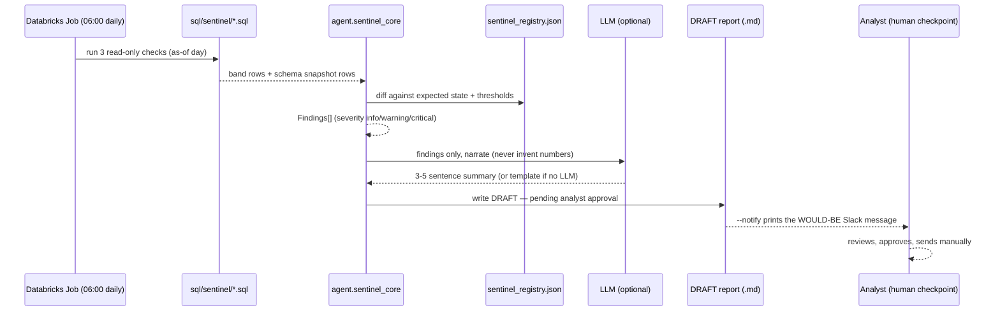

# Sentinel: Anomaly & Schema-Drift Watchdog (module M5, PDF task 5.5)

One-pager for the deck. The sentinel is a small, read-only watchdog that
runs after the daily ETL and tells an analyst — never a stakeholder
directly — when today's event volumes, funnel rates, or live schema look
different from what the last 28 days (or the registry) said to expect.

## Trigger

- **Schedule**: daily, shortly after the medallion ETL finishes — e.g.
  **06:00**, as a Databricks Workflows Job running
  `notebooks/sentinel_job.ipynb` (see `docs/deploy_guide.md` §7 for the
  Turkish step-by-step Job-creation instructions).
- **Locally / CI**: `python scripts/sentinel.py`, same checks, same logic,
  against DuckDB — used for development and for every test in
  `tests/test_sentinel.py`.
- Both entry points score the same **as-of day** by default: the latest
  *mature* day in the data (see "False-positive management" below for why
  that is not simply "the max date").

## Inputs

- The three raw, governed tables the rest of this project already reads
  read-only: `web_events`, `app_events`, `id_bridge` (via `agent.db.get_driver`
  — DuckDB locally, Databricks in production).
- `config/sentinel_registry.json` — the **expected/baseline state**:
  known table→column→type schema, known `event_name` values per table,
  known `app_version` values, and the threshold knobs below. Generated
  once from the real data (`agent.sentinel_core.build_registry`) and
  meant to be reviewed/updated by a human, not auto-regenerated on every
  run — a registry that silently retrains itself on today's data could
  never catch drift that crept in gradually.

## Actions / Tools

Three versioned, read-only SQL files in `sql/sentinel/`, run through
`agent.db.get_driver()` exactly like every other query in this project —
**sentinel never writes to bronze/silver/gold, or to the raw tables**:

1. `daily_event_volumes.sql` — daily event counts by `event_name` ×
   segment (market for web, platform for app), with a trailing 28-day
   control band (`AVG`/`STDDEV` window functions, `ROWS BETWEEN 28
   PRECEDING AND 1 PRECEDING`) per series.
2. `daily_funnel_rates.sql` — same band pattern, applied to three daily
   step-conversion rates (start→complete, complete→download through the
   consented bridge population, download→pair).
3. `schema_snapshot.sql` — a live table/column/type inventory plus
   distinct `event_name` and `app_version` values, as cheap aggregates
   (`information_schema.columns`, `GROUP BY`), never a raw-row scan.

`src/agent/sentinel_core.py` (imported by both `scripts/sentinel.py` and
`notebooks/sentinel_job.ipynb`) turns those rows into typed `Finding`s by
comparing them against `config/sentinel_registry.json`'s thresholds —
**pure Python arithmetic, no SQL, no LLM call**. See "Statistics detect,
the LLM narrates" below for why that split matters.

## Output

A structured summary, always written to
`reports/sentinel/sentinel_<as_of>.md` and also printable as JSON
(`--format json`) for a downstream tool: an executive-summary narration,
findings grouped by severity (`critical`/`warning`/`info`), a compact
schema snapshot, and run metadata (thresholds used, driver, exit code).
Exit codes are Job-friendly: **0 clean, 1 warning(s), 2 critical** — a
Databricks Workflows Job can branch or alert on this without parsing the
report body at all.

### Statistics detect, the LLM narrates

Every `Finding` is produced by SQL window functions and registry diffing
in `agent.sentinel_core` — the same set of findings comes out whether or
not an LLM is configured. The LLM (`agent.llm.get_llm()` — Anthropic/OpenAI
when a key is present, otherwise `KeywordLLM`) is only ever handed the
**already-final** findings list and asked to phrase a 3-5 sentence summary
from the numbers given, never to invent one; `KeywordLLM` doesn't implement
`chat_step` at all, so its absence is exactly the signal `sentinel_core.narrate`
uses to fall back to a deterministic template — the same template every
offline test in `tests/test_sentinel.py` exercises. A narration failure
(no network, no key, malformed reply) always degrades to that template
rather than breaking the run: detection is load-bearing, narration is
cosmetic.

## Human checkpoint

The report's own header says it: **"DRAFT — pending analyst approval
(human checkpoint)."** `scripts/sentinel.py` and the notebook write a file
and print to a console/job log — neither ever calls a real notification
API. `--notify` prints the *exact* Slack message and recipient the
sentinel *would* send, plus a comment explaining why it stops there: an
automated system that can page a stakeholder on a false positive trains
people to ignore it. A human opens the DRAFT, judges whether it is a real
issue, and sends the real notification themselves.

## False-positive management (alert-fatigue awareness)

- **Thresholds, not a single line**: `config/sentinel_registry.json` has
  three severity tiers (`band_multiplier_info` 1.5σ, `_warning` 2.5σ,
  `_critical` 4.0σ) — most day-to-day noise lands as `info` (visible in
  the report, invisible to the exit code), and only a genuinely large
  deviation reaches `warning`/`critical`.
- **`min_volume_floor`**: a series below this many events/day (default 5)
  never triggers a finding, however large its z-score — a 2-event day
  swinging to 5 events is a 150% "spike" in relative terms and complete
  noise in absolute terms; flagging it daily is exactly how analysts learn
  to ignore a monitor.
- **`min_history_days`**: a series younger than this (default 14 days of
  trailing history) is never flagged — a metric can't be "anomalous" yet
  if there isn't enough history to know its normal range.
- **A maturity buffer, not just a multiplier** (`EVENT_MATURITY_BUFFER_DAYS`
  in `agent.sentinel_core`, default 6): several events here are naturally
  lagged behind an earlier step in the same journey (`app_store_redirect`
  and `app_open` both depend on elapsed time since a prior action), so the
  days closest to the data horizon are inherently under-observed — the
  same right-censoring idea `sql/medallion.sql` already applies to D30
  retention (`silver.app_user_stages.censored`), just at the day-volume
  level. `default_as_of()` therefore scores the latest **mature** day, not
  literally `MAX(event_timestamp)`; `tests/test_sentinel.py` has a test
  that deliberately scores the immature raw max date and confirms it
  *does* trip a false alarm, to make this an examined decision rather
  than a hidden one. `--as-of` always lets a human override it.
- **Weekly review of alert precision**: an analyst should keep a running
  tally of critical/warning findings marked "real issue" vs. "false
  positive" (a one-column addition to the DRAFT report's own tracking, or
  a lightweight spreadsheet) and revisit the three threshold knobs above
  monthly — a watchdog whose thresholds are never revisited only ever
  drifts towards being ignored, in either direction.

## Known dialect/verification caveat

`sql/sentinel/*.sql` mirrors `sql/medallion.sql`'s Databricks-safe
construct set (`AVG`/`STDDEV` window functions with an explicit frame,
named `WINDOW` clauses, `FULL OUTER JOIN`, `information_schema.columns`,
`current_catalog()`/`current_schema()`) and has been exercised here only
against DuckDB — this sandbox has no Databricks network access. One
concrete, expected difference: `config/sentinel_registry.json` was
generated from DuckDB, whose `TIMESTAMP` columns report as `TIMESTAMP_NS`;
Databricks reports the equivalent column as `TIMESTAMP`, so the very first
sentinel run against a freshly-loaded Databricks warehouse will show a
`schema_columns` "type changed" **warning** (not critical) for
`event_timestamp`/`linked_at` — expected and harmless, and the fix is to
regenerate the registry once from the Databricks connection
(`agent.sentinel_core.build_registry`) rather than to chase it as a bug.
