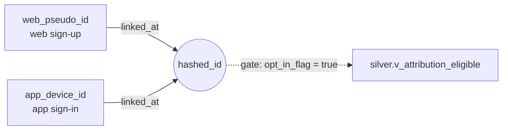

# Cross-Platform Tracking & Identity Stitching Specification

*(PDF task 5.1 — module M6.)* Specifies how events are named and
enveloped, how identities are — and are not — stitched across web and
app, and where consent state gates which joins are lawful. Sections 1–2
describe the target state; most of it is already implemented, and every
gap between target and inherited schema is called out rather than
glossed over. Section 3 states rules the codebase enforces mechanically,
not just documents; section 4 names the measurement artefacts the design
accepts rather than hides.

## 1. Event naming convention

**Rule**: `object_action`, snake_case, action in **base/infinitive form**
(`start`, `complete`, `view`, `redirect`, `open`, `pair`) — never past
tense, never a bare noun standing in for a verb.

**The inherited schema mixes three styles**:

| event_name | style | issue |
|---|---|---|
| `hearing_test_start/complete`, `page_view`, `result_screen_view`, `app_store_redirect`, `app_open` | `object_action`, base form | target-compliant |
| `hearing_aid_paired` | `object_action`, **past participle** | should be `hearing_aid_pair` |
| `remote_support_session` | noun, no verb | should be `remote_support_start` |

New event types must follow the base-form rule; the two legacy names
above are known debt, to be *aliased* rather than silently renamed so
old dashboards don't break silently — exactly the kind of change
`schema_version` (below) exists to signal.

### Common envelope

Every event MUST carry: `event_timestamp` (ordering, windowing),
`market` (consent-regime segmentation), `platform`/`device`
(`device_category` web-side, `platform` app-side), `consent_state`
(which joins/reports the row may feed, §3), and `schema_version`
(payload contract version).

Today's tables approximate this unevenly: `web_events` carries
`country`, `device_category`, `consent_state` directly; `app_events`
carries only `platform` — `market`/`consent_state` are reachable only by
joining through `silver.v_attribution_eligible`, i.e. only for the
bridge-linked subset. Giving `app_events` its own `market`/
`consent_state` columns (the generator already computes both per user,
upstream of the event tables) is the natural next step.

**Why `schema_version` — drift detection.** The sentinel
(`config/sentinel_registry.json` + `sql/sentinel/schema_snapshot.sql`,
via `src/agent/sentinel_core.py`) already diffs live table/column/type
shape and live `event_name`/`app_version` values against a reviewed
baseline, once daily, after ETL — but only after the fact, by
re-deriving "what changed." `schema_version` is a cheaper, earlier
signal of the same failure class: the producer asserts a version at
write time, so a consumer (or the sentinel) can flag an unexpected value
immediately rather than waiting for a column-level diff. The two are
complementary: `schema_version` catches changes the producer forgot to
announce; the sentinel catches ones nobody announced at all.

## 2. Three-tier identity model

### Tier 1 — deterministic (sign-in chain)

The one lawful, deterministic cross-device link. `id_bridge` is an
**extended mapping table**: `hashed_id ↔ web_pseudo_id` (captured at web
sign-up) and `hashed_id ↔ app_device_id` (captured at app sign-in), with
`linked_at` timestamping when the link became valid (used by the
temporal-order rule — app activity must post-date the web activity it is
attributed to; `docs/knowledge/methodology.md`). All three ids are
**pseudonymised, not anonymised** (`docs/knowledge/privacy.md`): a
stable hash is still linkable back to a person given auxiliary data, so
`id_bridge` stays in scope for consent/retention/deletion obligations.

### Tier 2 — campaign-cohort (no identity join)

Links a **campaign to an install**, not a person to a person. On
Android, the Play Install Referrer API returns the UTM attached to the
Play Store click at first launch, giving campaign attribution with no
sign-in required — at cohort/channel grain only, never row-level.
**Stated asymmetry**: iOS has no equivalent — Apple exposes no install
referrer, and SKAdNetwork (where used) reports privacy-aggregated
postbacks, not a per-install string. Campaign-cohort attribution on this
tier is therefore Android-only *by platform constraint*; an iOS-vs-
Android comparison must say so, not report iOS as zero campaign volume.
**Not yet implemented**: `app_events` today carries no referrer field.
Adding one is scoped to Android's first `app_open` per device only —
never backfilled onto later events, which would re-attribute a device's
whole lifetime to whatever campaign was live at install.

### Tier 3 — aggregate-only

No identity or campaign linkage: per-market/channel/device-category
counts and rates on each side independently (`gold.completion_by_channel`,
`gold.completion_by_device`, weekly volumes). Always computable, from
every row, regardless of consent or sign-in — see §3.

## 3. Consent gating

GDPR (DE, UK) and CCPA (US) do not gate the same rows the same way, and
illegal joins should be structurally hard to write, not merely forbidden
in a doc.

| consent state | row-level cross-device attribution | channel-level attribution | aggregate reporting |
|---|---|---|---|
| **granted + signed-in (both sides)** | **Yes** — the only case producing an `id_bridge`/`v_attribution_eligible` row | **Yes** — first-touch (`acquisition_channel`) and last-touch (`utm_campaign`) both resolve | **Yes** |
| **granted, not signed-in on both sides** | **No** — consent alone never produces a bridge row | **Yes, single-platform only** — web session-level or app-level metrics stand alone; no cross-device channel view | **Yes** |
| **denied** | **No** | **No** — must never resolve to a re-targetable channel | **Yes, non-personalised counts only** — e.g. total `page_view` volume, never joined to a pseudonym or channel |

The last row is already implemented: `gold.completion_by_channel`'s own
comment states it uses web pseudonymous ids "*so consent-denied users
are still visible at this aggregated level*" — gold aggregates run over
every row regardless of `consent_state`, correct *only* because the
aggregate never re-exposes a per-user id or feeds a cross-device join.

### Governance lives in the schema

`silver.v_attribution_eligible` is the **only** join path into row-level
cross-device linkage — never `bronze.id_bridge` directly. Enforced
twice, deliberately redundantly:

1. **In SQL** — every downstream mart reads the view, not the bronze
   table, so a future partial-consent dataset needs one filter change,
   not a rewrite of every query (`opt_in_flag` is true for every row
   today, so the view is currently a pass-through by design).
2. **In the agent** — the agentic loop's system prompt repeats the same
   rule as a guardrail ("cross-device web->app joins MUST go through
   `id_bridge` … or `silver.v_attribution_eligible` — never join web and
   app events directly"), so an ad-hoc natural-language query cannot
   route around the view even when a human forgets to ask for it.

### DE/UK opt-in vs. US opt-out

DE (strict GDPR opt-in) and UK (UK GDPR, close to the same model)
require an affirmative action before non-essential tracking; the US has
no single federal law, and CCPA/CPRA defaults to **opt-out**. That
default alone produces `linkable share: DE < UK < US` before any
behavioural difference (`docs/knowledge/privacy.md`;
`gold.linkable_share_by_market`). Any cross-market comparison of a
bridge-linked metric must state how much of the gap is consent-regime-
driven versus genuinely behavioural — a raw DE-vs-US number without that
caveat is a legal-posture artefact dressed up as a product insight.

## 4. Known measurement artefacts

- **Cross-device pseudo_id fragmentation.** ~15% of users complete the
  test under a *different* `user_pseudo_id` than the one that started it.
  Funnel logic uses `MIN`/first-qualifying-event per stage so stage
  totals are unaffected, but "one `user_pseudo_id`" cannot be assumed to
  mean "one person," even before any cross-device join is attempted.
- **Linkable-population selection bias.** `id_bridge` requires both
  consent and sign-in, so its population is systematically more engaged
  than the whole. Every bridge-linked metric is either an **upper bound**
  (pairing/retention) or a **lower bound** (download volume) on the true
  value, never the true value — the direction must be named whenever
  such a number is presented (`docs/knowledge/privacy.md`).
- **Right-censoring at window edges.** D30 needs a fixed 28–34-day
  post-open window; a device that hasn't reached it yet is excluded from
  both numerator and denominator, not counted as churned
  (`docs/knowledge/methodology.md`). The sentinel applies the same idea
  one level up: its as-of day is the latest date **minus a 6-day
  maturity buffer**, not the raw maximum, since an unclosed final day
  produces false "critical" drops from incomplete ingestion, not a real
  anomaly.

## 5. Implemented in this repo

| spec concept | file / object |
|---|---|
| Tier 1 extended `id_bridge` mapping | `src/generate_data.py` (id_bridge frame) → `sql/medallion.sql` `bronze.id_bridge` |
| Consent + sign-in join gate | `sql/medallion.sql` `silver.v_attribution_eligible` |
| Guardrail enforcement of the gate | `src/agent/agentic.py` system prompt; `src/agent/guardrails.py` |
| `schema_version` rationale / drift detection | `config/sentinel_registry.json`, `sql/sentinel/schema_snapshot.sql`, `src/agent/sentinel_core.py` |
| Selection-bias direction (upper/lower bound) | `docs/knowledge/privacy.md`; gold-mart `COMMENT`s in `sql/medallion.sql` |
| DE < UK < US linkable-share asymmetry | `docs/knowledge/privacy.md`; `gold.linkable_share_by_market` |
| Right-censoring / D30 window | `docs/knowledge/methodology.md`; `silver.app_user_stages` |
| Sentinel maturity buffer (day-level censoring) | `scripts/sentinel.py`, `docs/sentinel_design.md` |
| Naming-convention target state | `src/generate_data.py` `event_name` values (§1 names the two non-compliant legacy names) |
| Tier 2 campaign-cohort (Play Install Referrer) | Not yet implemented — design-only extension point on `app_events` |
